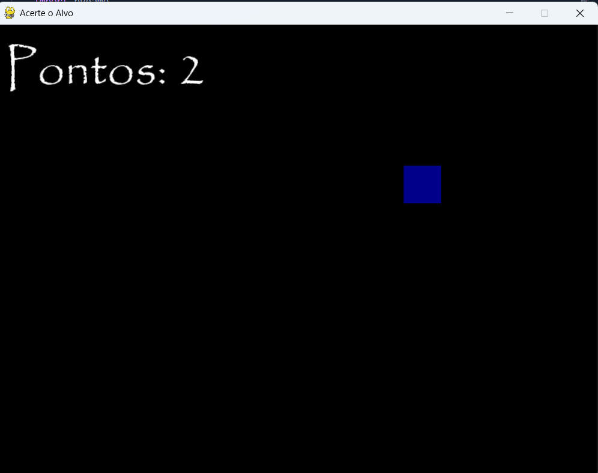
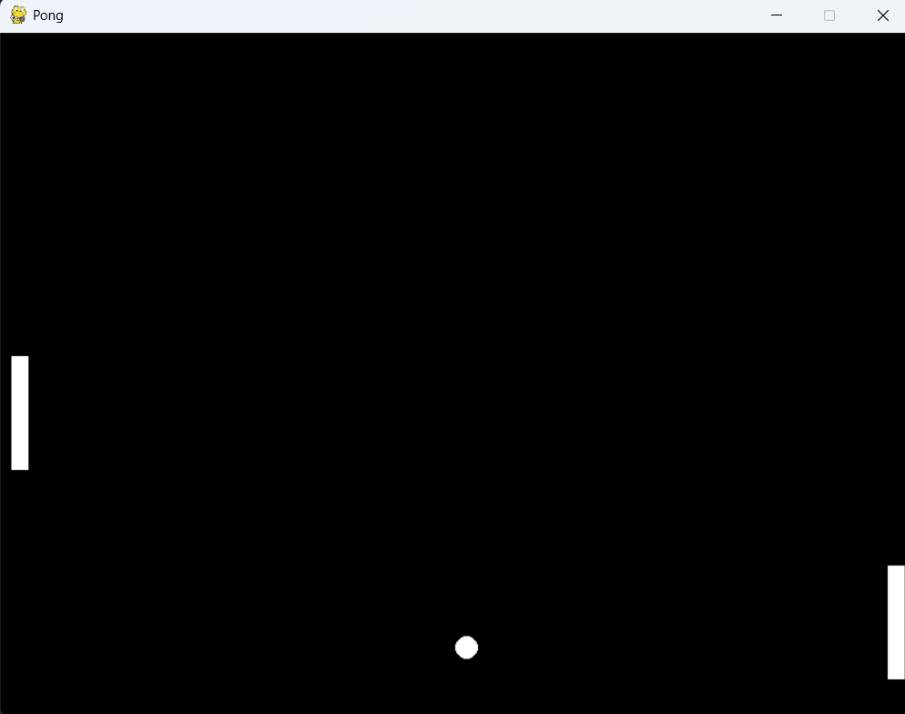

# Jogos em Python com Pygame

Este repositório contém dois jogos desenvolvidos em **Python** utilizando a biblioteca **Pygame**.
O projeto foi feito como forma de praticar lógica de programação e aprender mais sobre o desenvolvimento de jogos.

Os jogos incluídos são:

* **Acerte o Alvo** – um jogo simples de precisão e reflexo.
* **Pong** – uma recriação do clássico jogo de ping-pong.

---

## Sobre o Projeto

O principal objetivo foi colocar em prática conceitos fundamentais da biblioteca **Pygame**, como:

* Movimentação de objetos na tela
* Detecção de colisões
* Interação com teclado e mouse
* Pontuação e sons
* Atualização constante da tela

Cada jogo está em um arquivo separado e pode ser executado individualmente.

---

## Estrutura do Repositório

```
jogos-pygame/
├── acerte_o_alvo.py
├── pong.py
├── acerto.ogg
├── erro.ogg
└── README.md
```

Os arquivos `acerto.ogg` e `erro.ogg` são usados no jogo **Acerte o Alvo** para os sons de acerto e erro.

---

## Jogos

### Acerte o Alvo (`acerte_o_alvo.py`)

Neste jogo, o jogador precisa clicar em um quadrado azul (o alvo) que aparece em posições aleatórias na tela.
Cada acerto aumenta a pontuação e cada erro faz perder pontos, mas a pontuação nunca fica negativa.

**Como jogar:**

* Use o mouse para clicar no alvo.

**Recursos:**

* Sons de acerto e erro
* Pontuação em tempo real
* Alvo mudando de posição de forma aleatória

**Print do jogo:**

> 

---

### Pong (`pong.py`)

Uma versão simples do clássico Pong, feita para dois jogadores.
Cada jogador controla uma raquete e precisa rebater a bola sem deixar que ela passe.

**Controles:**

* Jogador 1: teclas **W** (para cima) e **S** (para baixo)
* Jogador 2: setas **↑** (para cima) e **↓** (para baixo)

**Recursos:**

* Colisões entre bola, paredes e raquetes
* Contagem de pontos para ambos os jogadores
* Movimentos suaves e responsivos

**Print do jogo:**

> 

---

## Requisitos

Para rodar os jogos é necessário ter o **Python 3** instalado e também a biblioteca **Pygame**.
Caso ainda não tenha o Pygame, instale com o comando:

```bash
pip install pygame
```

---

## Como Executar

1. Clone o repositório:

   ```bash
   git clone https://github.com/usuario/jogos-pygame.git
   cd jogos-pygame
   ```

2. Execute o jogo desejado:

   ```bash
   python acerte_o_alvo.py
   ```

   ou

   ```bash
   python pong.py
   ```

---

## Tecnologias Utilizadas

* Python 3
* Pygame

---

## Licença

Este projeto foi desenvolvido com fins educacionais.
Pode ser usado e modificado livremente para estudos e aprendizado.

